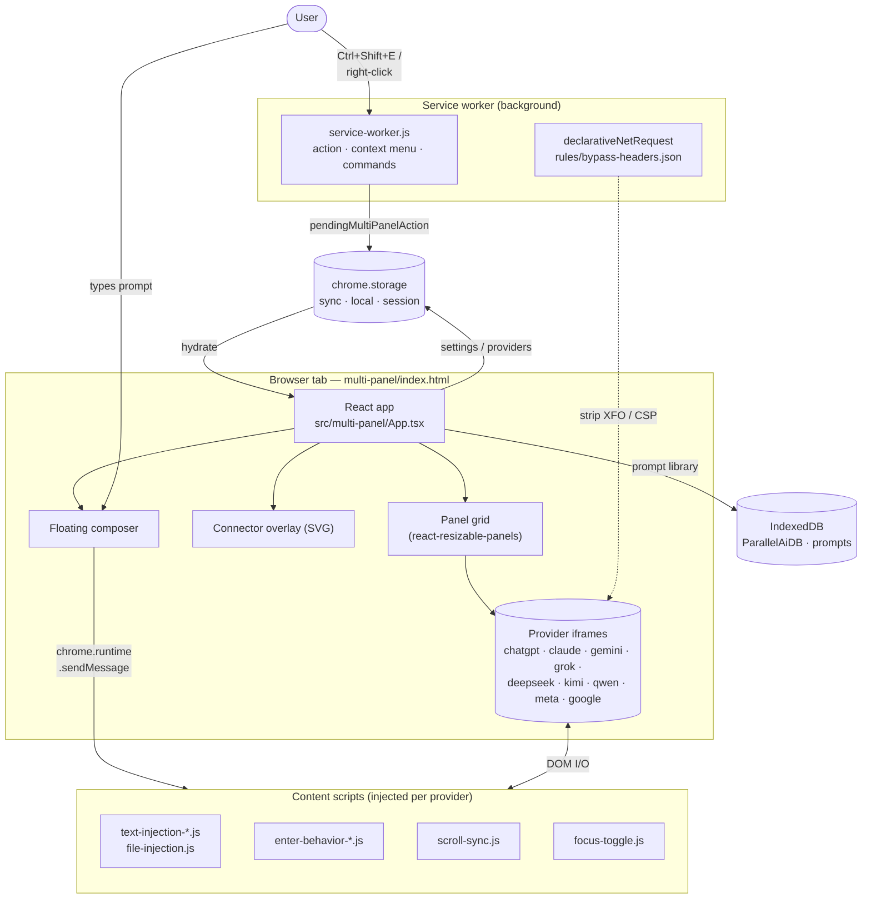
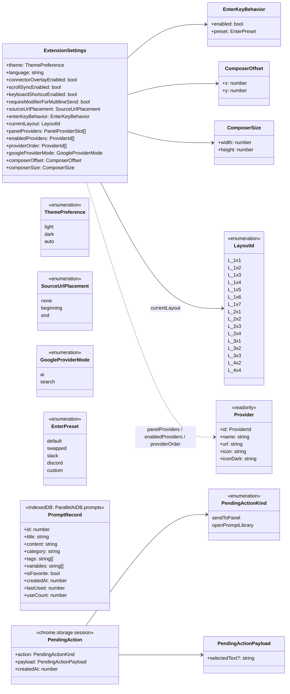

# Parallel AI

> Compare AI chatbot responses side-by-side in a unified, tabbed workspace.

A Chrome extension that loads multiple popular AI chats — ChatGPT, Claude, Gemini, Grok, DeepSeek, Kimi, Qwen, Meta AI, and Google AI Search — into a single resizable grid, with one shared composer that fans your prompt out to every panel at once.

A modern, minimal UI that stays out of your way: every control lives in one floating composer window you can drag and resize anywhere on screen. Each provider pane has its own collapsible control capsule for toggling, swapping providers, and reordering — so you can shape the layout to fit whatever you're comparing.

<!-- Replace with the recorded Screen Studio export once available. GitHub renders local mp4/webm inline. -->
<p align="center">
  <video src="video/demo.mp4" controls width="820"></video>
</p>

> If the inline player does not render, [watch the demo here](video/demo.mp4).

---

## Why

Comparing answers across LLMs today means juggling tabs, retyping the same prompt, and losing track of which model said what. Parallel AI lets you:

- Type once, dispatch everywhere — every active panel receives the same prompt and attachments.
- Lay out 1×N, 2×N, 3×N, or 4×N grids; resize columns and rows freely by dragging the edges.
- Drop in images and files; they're forwarded to each provider's native uploader all at once.
- Watch a glowing connector animate from your composer to each panel as the prompt fills and submits.
- Sync scrolling across panels so long answers stay roughly aligned.
- Run a temporary/incognito chat across the providers that support it (ChatGPT, Claude, Gemini, Grok, Qwen).
- Manage a personal prompt library with variables, categories, and favorites.

## Zero setup

It works directly through your existing accounts with each provider — no middleman, no extra subscription, no API keys to manage. Everything happens locally in your own browser session: no server, no telemetry, no credentials ever leave your machine. Each panel is just an iframe to the provider's normal web UI, signed in as you.

---

## Features

| Area | What it does |
| --- | --- |
| **Unified composer** | Floating, draggable, resizable input that fans prompts to every active panel. |
| **Provider grid** | Up to 16 panels in 1×N / 2×N / 3×N / 4×N layouts, each resizable. |
| **Connector overlay** | Animated SVG connectors visualize fill → submit → settle for each provider. |
| **Attachments** | Drag, drop, or paste images / PDFs / text files; forwarded to each provider's uploader. |
| **Scroll sync** | Percentage-based scroll syncing across iframes, opt-in. |
| **Temporary chat** | One-click toggle for incognito/temporary modes on supported providers. |
| **Prompt library** | IndexedDB-backed prompts with variables, search, favorites, import/export. |
| **Theming** | Dark, light, or auto (follows your OS preference) — the composer and panel chrome switch with the rest of the UI. |
| **Settings** | In-app modal for theme, language (10 locales), provider order, Enter-key behavior, keyboard shortcuts. |
| **Context menu** | Right-click any page or selection → "Pre-fill this in Parallel AI" opens the workspace with that text loaded into the composer (ready for you to review or edit before sending). |
| **Keyboard shortcuts** | `Ctrl/Cmd+Shift+E` opens the workspace; `Ctrl/Cmd+Shift+L` opens the prompt library. |

---

## Supported providers

| Provider | URL |
| --- | --- |
|  &nbsp; ChatGPT | <https://chatgpt.com> |
|  &nbsp; Claude | <https://claude.ai> |
|  &nbsp; Gemini | <https://gemini.google.com> |
|  &nbsp; Grok | <https://grok.com> |
|  &nbsp; DeepSeek | <https://chat.deepseek.com> |
|  &nbsp; Kimi | <https://www.kimi.com> |
|  &nbsp; Qwen | <https://chat.qwen.ai> |
|  &nbsp; Meta AI | <https://www.meta.ai> |
|  &nbsp; Google (AI / Search) | <https://www.google.com> |

This list is growing — suggestions for new providers are welcome. Open an issue or PR if there's a chatbot you'd like to see added.

You stay logged in directly with each provider — Parallel AI never sees credentials or message contents.

---

## Architecture

The extension is composed of three runtime contexts:

1. **Multi-panel page** (`multi-panel/index.html`) — a React app loaded in a normal browser tab. Renders the grid, composer, modals, and connector overlay.
2. **Service worker** (`background/service-worker.js`) — wires up the action button, context menus, and keyboard commands; bridges them to the multi-panel page via `chrome.storage.session`.
3. **Content scripts** (`src/content/*.ts` + `content-scripts/*.js`) — injected into each provider's page (which lives inside an iframe in the multi-panel app). Responsible for text injection, file uploads, scroll-sync, focus/Enter-key behavior.

`declarativeNetRequest` rules (`rules/bypass-headers.json`) strip `X-Frame-Options` and `Content-Security-Policy` headers from the supported provider domains so they can be embedded as iframes.



### Prompt dispatch in one paragraph

When you submit, `useProviderActionsController` resolves which active providers should receive the prompt, asks `useConnectorController` to arm the SVG connectors (idle → filling), then `useProviderFramesController.postToProvider` posts the text and queued files to each iframe via `chrome.runtime.sendMessage`. The provider's content script (`text-injection-*.js`, `file-injection.js`) finds the textarea and upload input, injects, and presses Send. The connector animates submitting → settled as each provider acknowledges, with a fallback timer in case acknowledgment is missed.

---

## Settings & storage model

Three persistence layers back the app: `chrome.storage.sync` (cross-device user prefs), `chrome.storage.session` (transient pending actions from the service worker), and IndexedDB (prompt library, which can grow unboundedly).



> Note: actual `LayoutId` values are `"1x1" … "4x4"`; the diagram prefixes them with `L_` so the Mermaid parser accepts them as enum identifiers.

Settings are normalized on every read in `src/shared/lib/settings.ts` so legacy keys, missing fields, or values from older versions migrate cleanly.

---

## Project structure

```
parallel-ai-extension/
├── manifest.json                  Chrome MV3 manifest
├── multi-panel/index.html         Entry HTML for the workspace tab
├── background/service-worker.js   MV3 service worker (action, commands, context menu)
├── content-scripts/               Vanilla-JS content scripts injected into provider pages
├── rules/bypass-headers.json      declarativeNetRequest rules (strip XFO/CSP for iframes)
├── src/
│   ├── multi-panel/
│   │   ├── App.tsx                Top-level wiring of all hook-controllers
│   │   ├── main.tsx               React entry
│   │   ├── components/            FloatingComposer, PanelWorkspace, ConnectorOverlay, modals…
│   │   ├── hooks/                 useConnectorController, usePanelLayoutController, etc.
│   │   └── lib/                   panel-layout, connector-scene, connector-geometry, runtime
│   ├── content/                   Per-provider entry that imports the right vanilla scripts
│   └── shared/
│       ├── components/            Button, Input, Modal, Switch, Select, Textarea…
│       ├── contexts/              SettingsContext, ProviderContext
│       ├── hooks/                 useI18n
│       └── lib/                   providers, settings, layouts, prompt-manager, theme, …
├── icons/                         Extension + provider icons (light/dark)
├── public/graphics/               App graphics referenced from index.html
├── data/                          Default prompt libraries, version-info
├── _locales/                      10 locales (en, de, es, fr, it, ja, ko, ru, zh_CN, zh_TW)
├── tests/                         Vitest unit tests for shared/lib modules
├── docs/                          Internal design notes (not user-facing)
├── tsconfig.json · vite.config.ts · tailwind.config.ts · vitest.config.ts
└── package.json
```

---

## Getting started

### Prerequisites

- [Bun](https://bun.sh) `1.3+` (used as the package manager and script runner)
- Google Chrome / Chromium / Edge (anything that supports MV3)

### Install dependencies

```bash
git clone https://github.com/parkercai3/parallel-ai-extension.git
cd parallel-ai-extension
bun install
```

### Develop

```bash
bun run dev
```

Vite + `@crxjs/vite-plugin` watches sources and rebuilds `dist/` in place.

### Build a loadable extension

```bash
bun run build
```

The output lands in `dist/`.

### Load it into Chrome

1. Open `chrome://extensions`.
2. Toggle **Developer mode** (top-right).
3. Click **Load unpacked** and select the `dist/` folder.
4. Pin the **Parallel AI** action and click it (or press `Ctrl/Cmd+Shift+E`) to open the workspace.

### Tests

```bash
bun run test
```

Vitest runs against the `src/shared/lib/*` modules with `happy-dom` and `fake-indexeddb`.

---

## Keyboard shortcuts

| Shortcut | Action |
| --- | --- |
| `Ctrl/Cmd+Shift+E` | Open the Parallel AI workspace |
| `Ctrl/Cmd+Shift+L` | Open the prompt library |
| `Enter` | Send (configurable; can require Shift, Ctrl, or be swapped) |
| `Esc` (in composer) | Stop generation across all panels |

> The two extension-level shortcuts above are *suggested defaults*. Chrome only auto-binds them for Web Store installs and only when no other extension already claims the combo — otherwise they show up unbound. Open `chrome://extensions/shortcuts`, find **Parallel AI**, and click the pencil icon to set or change either binding. If a shortcut shows as bound but does nothing (e.g. a previously installed extension left a stale registration), clear it with the **`X`** and rebind.

---

## Tech stack

- **React 18** + **TypeScript** (strict)
- **Vite 8** + [`@crxjs/vite-plugin`](https://crxjs.dev) for MV3 bundling
- **Tailwind CSS v4**
- [`react-resizable-panels`](https://react-resizable-panels.vercel.app) for the splitter grid
- `lucide-react` for icons
- **Chrome Storage API** (sync + session) and **IndexedDB** for persistence
- **Vitest** + `@testing-library/react` + `happy-dom` + `fake-indexeddb` for tests

---

## Privacy

- No analytics, no telemetry, no remote servers run by this project.
- Each panel is an iframe to the provider's own site, signed in as you.
- Settings live in `chrome.storage.sync`; prompts live in IndexedDB on your device.
- The only `host_permissions` are the supported provider domains, used so content scripts can inject text/files into the providers' UIs.

---

## Roadmap / known limits

- Provider sites change their DOMs frequently; selectors in `content-scripts/text-injection-*.js` and `content-scripts/enter-behavior-*.js` may need touch-ups when that happens.
- Some providers occasionally refuse iframing despite header stripping; reload the panel from the panel header if a provider fails to load.
- Temporary-chat support is provider-dependent (currently ChatGPT, Claude, Gemini, Grok, Qwen).

---

## Contributing

Issues and PRs are welcome. If you're adding a new provider, you'll typically need to:

1. Add the provider to `src/shared/lib/providers.ts`.
2. Add a content-script entry under `src/content/<provider>.ts` that imports the relevant vanilla helpers.
3. Add `text-injection-<provider>.js` and `enter-behavior-<provider>.js` under `content-scripts/`.
4. Add the provider's host pattern to `manifest.json` (`host_permissions` + `content_scripts`) and a header-strip rule to `rules/bypass-headers.json`.

---

## Credits

Some of the per-provider content-script logic (text injection, Enter-key handling) and the default prompt-preset templates are adapted from [Manho/Panelize](https://github.com/Manho/Panelize). Many thanks to that project for the prior art.

---

## License

MIT License — see [LICENSE](LICENSE) for details.
